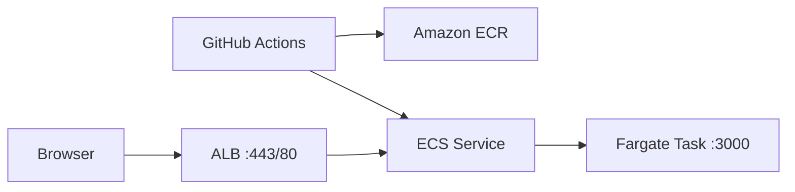

# Deploy OWASP Security Lab to AWS (ECS Fargate)

This guide wires the repo’s Docker image and GitHub Actions deploy workflow to **Amazon ECS on Fargate** behind an **Application Load Balancer (ALB)**.

> **Lab only:** The app exposes intentional vulnerable routes. Use a private VPC, restrict ingress, and never point production traffic at it without hardening.

## Architecture



## 1. One-time AWS setup

### ECR repository

```bash
aws ecr create-repository --repository-name waf-lab --region us-east-1
```

### CloudWatch log group

```bash
aws logs create-log-group --log-group-name /ecs/waf-lab --region us-east-1
```

### ECS cluster

```bash
aws ecs create-cluster --cluster-name waf-lab-cluster --region us-east-1
```

### IAM roles

- **Task execution role** (`ecsTaskExecutionRole`): attach managed policy `AmazonECSTaskExecutionRolePolicy` (pull from ECR, write logs).
- **Task role** (`ecsTaskRole`): optional; empty is fine for this app.

Register the task definition after editing `deploy/ecs-task-definition.json`:

- Replace `ACCOUNT_ID`, `REGION`, and `ECR_REPOSITORY`.
- Set `executionRoleArn` / `taskRoleArn` to your role ARNs.
- Match `awslogs-region` to your region.

```bash
aws ecs register-task-definition \
  --cli-input-json file://deploy/ecs-task-definition.json \
  --region us-east-1
```

### Networking (ALB + Fargate)

1. Create a VPC (or use default) with **two public subnets** in different AZs.
2. Create an **ALB** security group: allow inbound `80`/`443` from your IP or `0.0.0.0/0` (lab only).
3. Create a **task** security group: allow inbound `3000` **only from the ALB security group**.
4. Create target group: type **IP**, port **3000**, health check path `/health`.
5. Create ALB listener → forward to that target group.
6. Create ECS service:
   - Launch type: **FARGATE**
   - Task definition: `waf-lab`
   - Desired count: `1`
   - Network: awsvpc, public subnets, assign public IP (simplest for a lab) or NAT for private subnets
   - Load balancer: container `waf-app:3000` → target group

Example (adjust subnet/SG IDs):

```bash
aws ecs create-service \
  --cluster waf-lab-cluster \
  --service-name waf-lab-service \
  --task-definition waf-lab \
  --desired-count 1 \
  --launch-type FARGATE \
  --network-configuration "awsvpcConfiguration={subnets=[subnet-aaa,subnet-bbb],securityGroups=[sg-task],assignPublicIp=ENABLED}" \
  --load-balancers "targetGroupArn=arn:aws:elasticloadbalancing:...,containerName=waf-app,containerPort=3000" \
  --region us-east-1
```

Open the ALB DNS name in a browser: `http://<alb-dns>/dashboard.html`.

## 2. GitHub configuration

### Repository variables (`Settings → Secrets and variables → Actions → Variables`)

| Name | Example | Required |
|------|---------|----------|
| `AWS_REGION` | `us-east-1` | No (defaults to `us-east-1`) |
| `ECR_REPOSITORY` | `waf-lab` | Yes |
| `ECS_CLUSTER` | `waf-lab-cluster` | Yes |
| `ECS_SERVICE` | `waf-lab-service` | Yes |
| `AWS_ROLE_ARN` | `arn:aws:iam::123456789012:role/github-actions-waf` | Recommended (OIDC) |

### Secrets (if not using OIDC)

| Name | Purpose |
|------|---------|
| `AWS_ACCESS_KEY_ID` | IAM user for deploy |
| `AWS_SECRET_ACCESS_KEY` | IAM user for deploy |

### OIDC (recommended)

1. In AWS IAM, create an OIDC identity provider for `token.actions.githubusercontent.com`.
2. Create role `github-actions-waf` trusted by your repo (`mahdiisabry1/WAF`) with policies:
   - `AmazonEC2ContainerRegistryPowerUser` (or scoped ECR push)
   - `AmazonECS_FullAccess` (or scoped `ecs:UpdateService`, `ecs:RegisterTaskDefinition`, `iam:PassRole` on execution role)
3. Set variable `AWS_ROLE_ARN` to that role’s ARN.

Deploy runs on push to **`main`** or manually via **Actions → Deploy to AWS (ECS) → Run workflow**.

## 3. Local Docker

```bash
docker compose up --build
# http://localhost:3000/dashboard.html
```

## 4. WebSockets behind ALB

The dashboard uses WebSockets (`/ws`). Ensure the ALB target group stickiness is optional; for a single task, default ALB HTTP routing is enough. For HTTPS, use an ACM certificate on the listener and set **idle timeout** ≥ 60s if connections drop.

## Troubleshooting

| Symptom | Check |
|---------|--------|
| Deploy fails at ECR | `ECR_REPOSITORY` variable and IAM ECR permissions |
| ECS service unstable | CloudWatch `/ecs/waf-lab` logs; task SG allows ALB → :3000 |
| 502 from ALB | Target group health: `/health` must return 200 |
| WS disconnects | ALB idle timeout; use `wss://` when using HTTPS listener |
